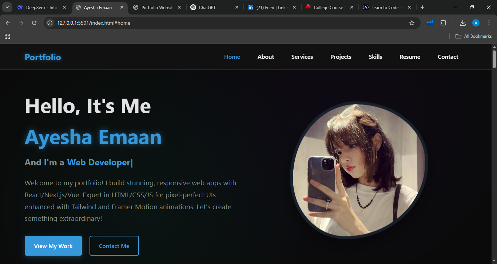

# 🌟 Portfolio Website  
**Task 1 Submission for Arch Technologies Internship**  

A fully responsive personal portfolio website built with HTML, CSS, and JavaScript. Hosted on GitHub Pages. 

## 📸 Screenshots  
| Desktop View |  
   

---

🔗 **Live Demo:** [View Portfolio](https://ayesha-emaan.github.io/Portfolio-Website/)  
📂 **GitHub Repo:** [Source Code](https://ayesha-emaan.github.io/Portfolio-Website)  

---

## 🚀 Features  
- **Responsive Design**: Works on mobile, tablet, and desktop.  
- **Modern UI**: Clean animations and interactive elements.  
- **Sections**:  
  - Home/Banner  
  - About Me  
  - Skills/Technologies  
  - Projects  
  - Contact Form   

---

## 🛠️ Technologies Used  
- **Frontend**: HTML5, CSS3, JavaScript  
- **Frameworks/Libraries**: (e.g., Bootstrap, Font Awesome)  
- **Tools**: Git, GitHub Pages, VS Code  

---

## 📂 Project Structure  
repo-name/  
├── index.html          # Main HTML file  
├── styles.css          # CSS files    
├── scripts.js          # JavaScript files  
├── assets/             # Images/icons  
│   ├── images/  
│   └── developer-illustration.png 
├── README.md           # This file  
└── SS1.png/        # Project previews  
🧑‍💻 How to Run Locally
Clone the repo:

bash
git clone https://github.com/your-username/repo-name.git
Open index.html in your browser.

📬 Contact

Ayesha Emaan

💼 Web Developer | Python Developer

📧 emaanayesha50@gmail.com
